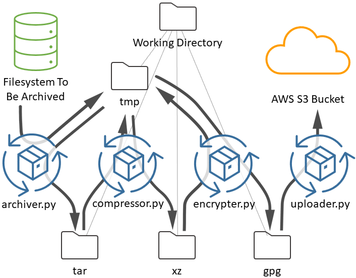

# Archiver
Archiver is a simple, straightforward backup program that will back up a large, slow to access, slow to change 
filesystem. It steps through directories in alphabetical order and creates the largest tar archive files below a 
specified size. These pieces are then compressed using xz, encrypted with pgp, and uploaded to an Amazon S3 Deep 
Glacier Archive.

This program is ideal for creating a backup, archive, or copy of a filesystem when:
* The volume too large to image
* There is not enough local free space to store a copy of the contents
* It will take weeks or months to copy the directory due to an array having slow random-access read speeds

*Note:* Archiver is written for **Linux** systems.

Archiver works by creating an archive file pipeline in a selected working directory. 

Archiver includes the following features:
* It creates a bunch of independent archive chunks
  * The task of backing up can then be done in small pieces
  * Loss or corruption of one archive does not affect the others
  * File names describe the archive contents, as succinctly as possible
* Archiving will recursively archive directories that are too big to fit in a single archive
* Function 
* The archive, compression, encryption, and upload processes work in parallel
* Archiving pauses when the working directory exceeds a specified size threshold
* Archiving creates a checkpoint file so it will restart where it left off
* On errors, notifications are sent by email
* A central log is kept of each piece moving through the pipeline
* Program can run for months autonomously

# Overview



The four stages of the archiver pipeline are shown in the figure above, archiver, compressor, encrypter, and uploader.
The archiver, compressor, and encryptor prodiuce all store their output files into the local tmp directory and only move the
result to the appropriate result directory when the job is complete and the file is ready to be picked up by the
next stage. The final stage, uploader, writes no local data.

## Directory Tree

`dir_tree_archiver.sh` runs `find` to create and save a listing of filesystem directories. This can help find which files
are in which archive.

# Configuration

Copy this project to a location on the target system. For examples that follow, "/opt/archiver" is assumed to be used.

Pick a working directory in which archiver can stage files. For good efficiency, this staging 
area should have good random read performance so simultaneous archive, compression, encryption and export operations
can be performed without putting additional demands on the large, slow, backup target. This working directory should
have enough free space to hold several archive files. For examples that follow "/archive" is assumed to be used.

The archive checks the working directory size before creating the next archive. By default, it is set to 2 TB. It can
be changed through a command line option or changing the default in the code. 

In the working directory, put a symmetric encryption key in a file named "passphrase.txt". Since AES256 encryption is 
used by default, a 256-bit (32 character) key is recommended.

Add entries in crontab to run each stage of the pipeline. Use the `flock` command to avoid starting multiple instances 
of each handler. Run each command as frequently as desired. The uploader exits after an upload if it has been running 
for more than 50 minutes. This is so an upload process with a long queue does not continue into business hours.

The compressor command accepts a "-t" argument indicating the number of threads to run in parallel for encryption.

The tree archiver should be run less frequently. The configuration below has it running once a month.

A handy command to check for files running through the pipeline is `tree -h -P "*txt|*tar|*xz|*gpg" /archive`

## Crontab Example

Here is an example of a crontab configuration.

```
0 * * * * /usr/bin/flock -n /archive/archiver.lockfile /opt/archiver/archiver.py /data /archive
0 * * * * /usr/bin/flock -n /archive/compressor.lockfile /opt/archiver/compressor.py -t 16 /archive
0 * * * * /usr/bin/flock -n /archive/encrypter.lockfile /opt/archiver/encrypter.py /archive
0 0-6,20-23 * * * /usr/bin/flock -n /archive/uploader.lockfile /opt/archiver/uploader.py /archive
0 0 1 * * /opt/archiver/dir_tree_archiver.sh /data /archive`
```
